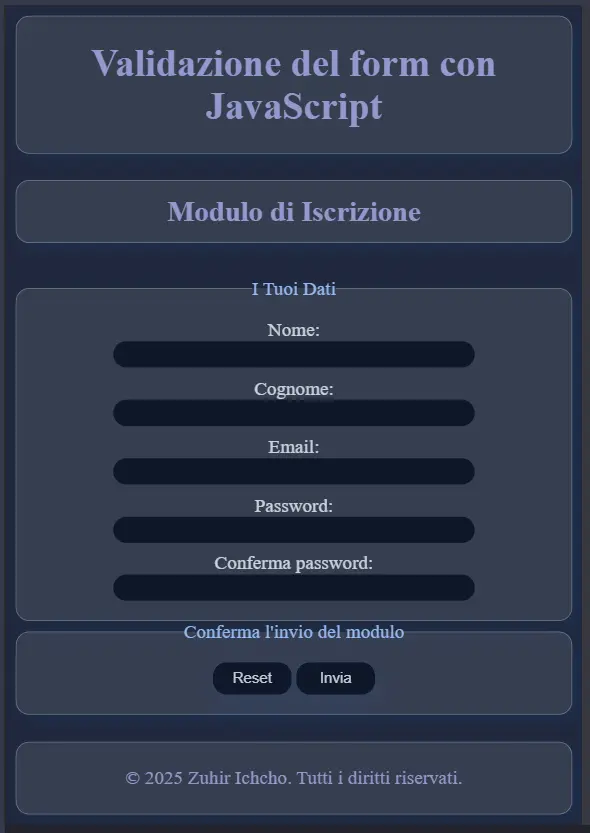

# Form di Registrazione – Demo Competenze Front‑End

Benvenuto in questo progetto di **form di registrazione moderno** pensato per dimostrare alcune delle mie competenze in **HTML, CSS e JavaScript**.  
Il form è completamente funzionante, convalidato e ottimizzato sia per l'accessibilità che per la responsive UI.

---

##  Funzionalità principali

-  **Validazione in tempo reale** dei campi input
-  Gestione sicura della **creazione utenti** tramite classi JavaScript (OOP)
-  **Design moderno** con effetto Glassmorphism
-  Ottimizzazione **mobile-first**
-  **Toast interattivo** per feedback visivo in fase di invio
-  Evita **registrazioni duplicate**
-  Pensato come **progetto vetrina** da mostrare nel portfolio

---

## 🛠️ Tecnologie usate

- `HTML5` – Semantica, accessibilità, SEO base
- `CSS3` – Custom properties, effetti UI moderni, stile responsive
- `JavaScript (Vanilla)` – Classi, OOP, validazioni, eventi DOM

---

## 📸 Anteprima



## 🧪 Come provarlo
1. Il repository  
   ```bash
   git clone https://github.com/tuo-username/nome-repo


Zuhir Ichcho
Front‑End Developer in formazione | Appassionato di UI, natura, moto e coding
📧 Mail: ichchozuhir@gmail.com
   


## 📝 Licenza

Distribuito sotto licenza **MIT**.  
Puoi usarlo, modificarlo e condividerlo liberamente con attribuzione.  
Per maggiori dettagli, vedi il file [LICENSE](LICENSE).
